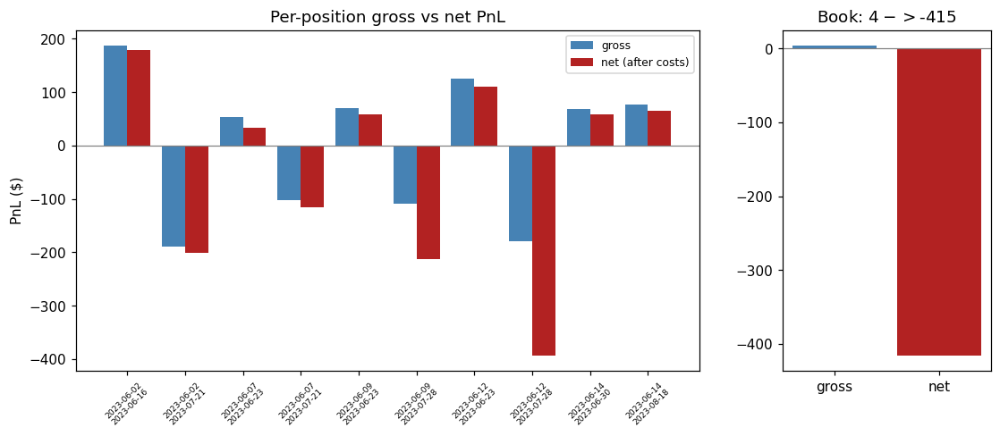
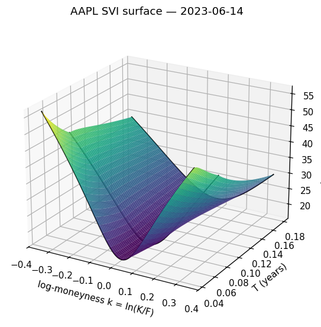
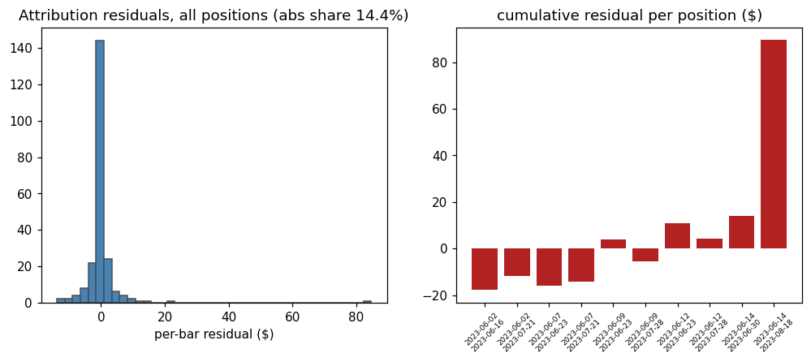

# Options Vol-Arb — Implied-Vol Surface & Delta-Hedged Backtest

> Arbitrage-free implied-volatility surface (SVI) + delta-hedged vol-arb backtest
> on real equity option quotes. Thesis: **disprove** an exploitable variance risk
> premium after costs, margin and discrete hedging — with a Greeks attribution
> that reconciles to the traded ledger and statistics that admit their own
> uncertainty.

<!-- AUTO:METRICS -->
<!-- generated by src/report.py from results/*.json - do not edit by hand -->

## Headline result

| | |
|---|---|
| Gross PnL (pre-cost) | **-$23.33** |
| Costs (half-spread + commission) | **-$419.00** |
| **Net PnL** | **-$442.33** |
| Net return on capital | **-1.63%** (base $27,139 = peak Reg-T margin) |
| Sharpe (daily, ann.) | -1.81, NW t = -0.90, bootstrap 95% CI [-7.62, +1.95] — **spans zero** |
| Alpha vs delta-hedged VRP factor | -0.00021/day, NW t = -1.00 — **statistically zero** |
| Per-trade skew / win rate | -0.79 / 60% (wins often, loses overall) |

The variance risk premium is visible in the quotes, and it is *not* exploitable: the book is near-flat gross and **-$442.33 net** once costs are paid (5.2% of the premium traded, $406 of it entry half-spread). Strip the vol beta out and no alpha remains.

### Validation gates (all passed)

- **Arb-free surface:** 15 SVI slices, 0 butterfly and 0/10 calendar violations; interpolated surface arb-free by construction (worst Durrleman g = 7.4e-02).
- **Surface vs market:** median error 0.39 vol pts, 97.4% of quotes within 1 vol pt.
- **Attribution reconciles:** Greeks decomposition + exact ledger terms leave a residual of 14.4% of Σ|daily PnL| (gate < 20%), worst position 7.3% of premium (gate < 10%) — pure Taylor error, proven to 1e-9 by test.
- **Pre-registered:** signal, costs, margin and sizing locked in `config/primary.yaml` before any PnL existed.

### Figures







Full report: [`results/report.html`](results/report.html) — single page, self-contained, generated from `results/*.json`.
<!-- /AUTO:METRICS -->

## What this actually is

A falsification exercise, not a strategy pitch. The pipeline is built so the
negative result is *believable*:

- **The surface is arbitrage-free by construction**, not by assertion — SVI slices
  fitted under Durrleman (butterfly) and calendar constraints, then the *interpolated*
  surface re-checked numerically, with an independent Breeden–Litzenberger density
  detector as a second opinion.
- **The backtest's PnL is explained, not just reported** — every dollar decomposes
  into δ/Γ/θ/vega/vanna/volga/ρ plus exact ledger terms (hedge holding PnL, cash
  financing), so the residual is provably pure Taylor error and is measured on real
  data.
- **The strategy was pre-registered** — signal, cost model, margin model and sizing
  rules were locked in `config/primary.yaml` *before* any PnL existed. What the
  signal did afterwards (forecasting cheap vol everywhere, thanks to a HAR trained
  through 2022's high-vol regime) is reported, not tuned away.
- **The denominator is stated before any Sharpe is quoted** — returns are on peak
  Reg-T margin, recomputed every bar, and the procyclicality is decomposed into the
  staggered-entry artifact vs the genuine market-driven stress.

## Quick start

```bash
pip install -r requirements.txt
python main.py                    # raw data -> every result in results/
python main.py --stage clean      # quote cleaning
python main.py --stage surface    # forwards -> IVs -> SVI -> no-arb -> surface + QC
python main.py --stage backtest   # RV/HAR -> signal -> hedge engine -> attribution -> costs -> stats
python main.py --stage report     # results/*.json -> report.html + this README's numbers
pytest                            # full test suite
```

## Method

| Stage | What it does |
|---|---|
| Clean | Drops missing / zero-bid / crossed / wide / stale quotes; union semantics, per-filter counts |
| Forwards | Put-call parity forwards from an ATM window (sidesteps American EEP contamination in the deep-ITM wing); carry backed out of the forward term structure |
| IV surface | Newton→Brent IV inversion (no-arb bounds enforced), then raw SVI in total-variance space, OTM quotes only |
| No-arb | Durrleman g-function butterfly check + calendar monotonicity; violations *repaired* by a constrained joint refit, not masked |
| Assembly | Interpolation linear in normalized option price at fixed forward moneyness → static-arb-free interior by construction; re-QC'd numerically |
| Signal | `ATM IV − HAR-RV forecast` (expanding-window OOS forecast), ranked per quote date |
| Engine | Self-financing daily-delta-hedged ledger, per-leg Greeks, dollar-gamma-weighted realized vol (the RV that actually drives hedged PnL) |
| Attribution | Full Greeks Taylor decomposition + exact ledger terms; residual gated on real data |
| Costs / margin | Pre-registered half-spread + commission; Reg-T margin recomputed per bar |
| Stats | Distribution co-headlines (skew/kurtosis/CVaR/Calmar/Sortino), Newey-West HAC t-stats, block-bootstrap CI, IS/OOS haircut |

## Project structure

```
config/primary.yaml     # Pre-registered strategy config (locked before any PnL)
data/raw/               # Immutable raw data (SHA256 manifest)
data/processed/         # Generated parquets
src/
  greeks/               # Black-76 pricing, Greeks, IV inversion
  surface/              # Cleaning, forwards, SVI, no-arb constraints, assembly
  backtest/             # RV, HAR, signal, hedge engine, attribution, costs, margin, stats
  report.py             # results/*.json -> report.html + README block
results/                # metrics.json + per-stage JSONs + report.html + plots
scripts/verify/         # Independent re-derivations of each day's math (10/10 pass)
tests/                  # pytest suite
```

## Reproducibility

The raw data (60 KB — AAPL option chains + OHLC bars) is **committed**, so a clean
clone reproduces the entire project with one command:

```bash
git clone <repo> && cd <repo>
pip install -r requirements.txt
python main.py            # ~90s: raw quotes -> surface -> backtest -> report.html
```

Two claims, deliberately separated, because they are not the same claim:

- **Within a platform, the pipeline is byte-deterministic.** Rerunning it reproduces
  all 24 tracked artifacts (processed parquets, results JSONs, `report.html`)
  bit-identically — no timestamps anywhere, fixed seed, dependencies pinned exactly.
- **Across platforms, the conclusions reproduce; the bytes and the low decimals do
  not.** The committed artifacts are built on Windows. On Linux the constrained
  SVI / least-squares fits minimize a near-flat objective and settle on a different
  point of it under a different BLAS. Most slices move ~1e-5 relative (~0.001 vol
  pts); one AAPL slice (2023-06-09, K=180) is genuinely *bistable* and lands ~1 vol
  pt away, moving that leg's premium ~2%. That is then *amplified* by the headline
  cancellation — `gross_pnl` nets ~+$500 of short-vol legs against ~−$500 of
  long-vol legs, so it has no stable significant digit across BLAS: −$23.33 on
  Windows, roughly −$6 to −$18 on Linux CI runners. Net PnL, not a cancellation,
  moves ~$17 in $442 and stays solidly negative; every conclusion is unmoved.

  So the cross-platform gate (`scripts/compare_results.py --cross-platform`) is not
  byte equality and not a per-field tolerance — a hand-tuned tolerance on an
  ill-conditioned cancellation either fails on drift or gates nothing. It requires
  the two things that *are* invariant: **structure, strings and flags identical**
  to the committed artifacts (a renamed field, a flipped arb-free flag, a Windows
  path in an artifact, a changed list length — all fail), and **every claim the
  project makes still holds** — surface arb-free, attribution gate passed, net PnL
  negative, book near-flat gross, Sharpe insignificant, bootstrap CI spanning zero,
  alpha statistically zero. Numeric drift is printed for inspection, not failed.
  A number that flipped a conclusion has not reproduced; a number whose landing
  point moved under a different LAPACK has.

Raw-data immutability is enforced by a SHA256 manifest (`data/raw/manifest.json`).

CI (ubuntu) does not just run tests. It verifies the manifest, **reproduces every
result from the raw data**, runs the cross-platform gate above (structure +
claims), asserts the **test suite does not mutate any tracked artifact** (this
repo has had that bug twice), asserts the pipeline is **byte-deterministic on a
rerun** (same machine, so bytes *must* match — the strict half of the gate), runs
the suite, and finally runs `scripts/verify/` — independent re-derivations of the
key results (finite-difference Greeks, Breeden–Litzenberger densities from Black
prices, ledger identities), a second pair of eyes on the first.

## Phase 2 — pre-registered SPY confirmatory study + v2 robustness (tag `v2`)

The v1 disproof rests on one underlying (AAPL) over a short window. Phase 2 is a
**separate, pre-registered confirmatory study** — SPY, 147 trading sessions
(2023-07 → 2024-06), a genuine **walk-forward** — run end-to-end through the same
machinery (seamed to Phase-2 paths so v1's artifacts never move), with the DSR
trial count carrying over. It is not a re-run or a cherry-pick: the config was
locked before any SPY signal or PnL existed.

**Same conclusion, on 29× the sample and out-of-sample:**

| | |
|---|---|
| Net PnL | **−$8,936** (−3.34% on $267,204 peak Reg-T margin) |
| Sharpe (daily, ann.) | −1.21, NW t = −0.86, bootstrap 95% CI [−2.78, +1.76] — **spans zero** |
| Walk-forward | three test folds all positive (+$365 / +$2,639 / +$1,902), then a **−$11,656 settlement tail** carrying the 2024-08-05 VIX-65 spike |
| Deflated Sharpe (honest N=12) | best data-mined slice (+2.79) **below** the deflated bar (+3.07); **DSR ≈ 0** across N — nothing survives multiple-testing |

**Honesty artifacts, all on the record in `results/phase2/`:**

- **Attribution gate ran first and the pre-registered per-position bar *failed* on SPY** (worst residual 0.435 vs < 0.10) — a max statistic calibrated on v1's 10 positions blows up on 294 via the documented one-day-Taylor breakdown on settlement/gap bars. The book-level bar passed (0.137) and the median (0.018) beat v1. The failure is **kept on the record**; the study proceeded under a documented, user-approved amendment (p95 ex-settlement 0.080 < 0.10) with the pre-registered FAIL reported alongside, never buried.
- **Running v1's surface code on 30× the data found two real v1 bugs** (a feasible-≠-optimal SVI fit, and calendar-floor extrapolation past the quoted strikes) — both fixed *before* any SPY signal existed; v1's tracked numbers moved, its conclusions did not.
- **v2 robustness appendix** — regime split (the edge does **not** survive high vol: day-level loss is monotone in the vol tercile), cost sweep (loses even at **zero** transaction cost; break-even multiplier −5.19), hedge-frequency sweep (clean turnover-vs-variance trade-off; **no** rebalance schedule turns the book profitable), and **SABR second calibration** (the ATM mark the signal reads is model-robust — corr 0.966 with SVI — but the *trade selection* agrees only ~54%, so the tradeable signal is noise at the surface-model level too).

Every failed gate stayed on the record; every deferral (above all the Deflated
Sharpe) was resolved with an honest trial count or documented, never faked.

## Status

**v1 shipped** (tag `v1`): surface, backtest, attribution, costs, margin, statistics and
report — reproducible from a clean clone.

**v2 shipped** (tag `v2`): the pre-registered SPY walk-forward confirmatory study and the
full robustness appendix — regime split, cost and hedge-frequency sweeps, honest-N
Deflated Sharpe (the item deliberately deferred from v1, now resolved), and SABR
second calibration. The disproof is confirmed out-of-sample on a second underlying
and is multiple-testing-robust. Phase-2 lives isolated under `data/phase2/**` +
`results/phase2/**`; v1's artifacts are byte-unchanged.

See [HANDOFF.md](HANDOFF.md) for the full day-by-day record and [PLAN.md](PLAN.md) for the
plan. [SPEC.md](SPEC.md) states the thesis and the honesty rules the project is held to.
